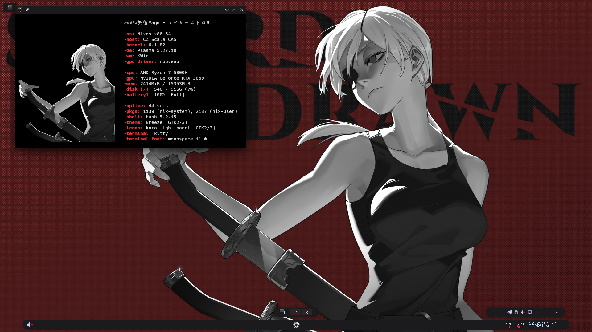

    <a href="https://github.com/msftyago/neofetch/screenshot.png">
        <picture>
        <source srcset="screenshot.png">
        
        </picture>
    </a>

customize the static texts in <code>config.conf</code> with your own for further modification, and place the config.conf to <code>~/.config/neofetch/
code> (overwrite) 

